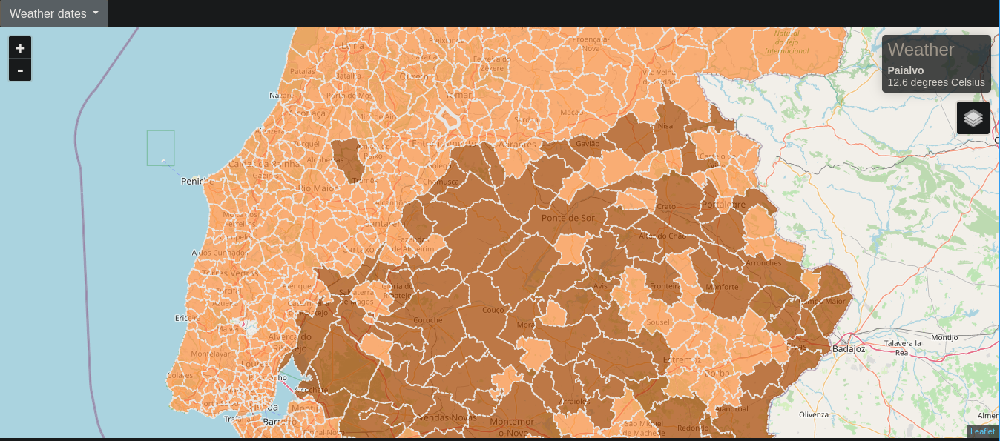
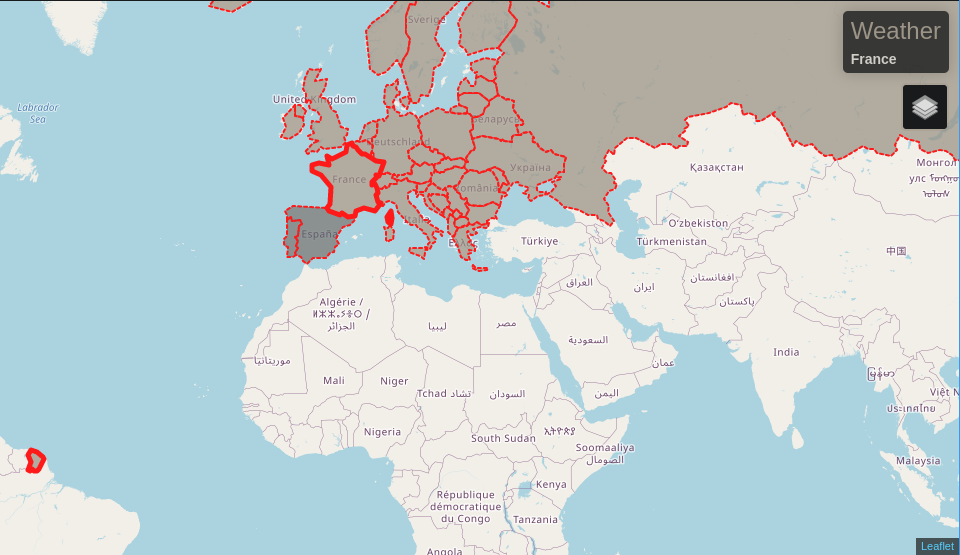

# Weather Data Backend Microservice

 

## Map projections
[geoJSONs Used.](https://github.com/nmota/caop_GeoJSON)

The Portugal geoJSONs that were available to me had two different Coordinates Reference System (CRS).

- The geoJSONs located in the root folder use the EPSG Projection 3763, that need proj4 to be successfully projected to the map.
- The geoJSONs in the "geograficas" folder use the EPSG Projection 4258, that can be projected without proj4.

 

## Backend
The user can upload a geoJSON to the backend. At the moment the geoJSON CRS is saved to the database, a request is made to an external API for the projection information of that CRS. That projection information is also saved to the database, to be used by proj4.
This means the user can upload various geoJSONs of different areas, each with their different CRS.
The user can also upload various geoJSONs of different areas, with the same CRS.
The geoJSON features also get saved to the database.
The user can then calculate the centers of each feature.
After calculating the center of each feature, the user can request an external API for the weather at every feature. The center coordinates get converted to latitude/longitude using the coordinates CRS projection information.

 

## Frontend
When the map loads, the server sends the various dates that the weather information was saved to the database, using EJS.
The client then dinamically creates a list of buttons with each date, and each button has the ID of the date in the database associated with its POST request.

 

## Weather API
The server calculates the center of each region border feature using its CRS coordinates, and saves them to the database. The featues that have the type MultiPolygon instead of Polygon don't have their center calculated, and their center is saved as null.
When fecthing the weatcher from the external API, it converts those coordinates from their saved CRS to latitude/longitude, uses those coordinates to fetch the weather. Regions with a null center, or with a center that hasn't been calculated at that point, don't have their corresponding weather fetched.

 

## Environment variables

DB_USERNAME

DB_PASSWORD

DB_URL

WEATHER_DATA_PORT

WEATHER_API_KEY

 

## MultiPolygon features
Some features in a geoJSON are made of various regions.
For example: French Guiana is a region of France situated on the coast of South America.
While on a map, this region belongs to France, it doesn't make sense to treat it as the same region for weather visualization purposes.
For this reason, an algorithm was implemented that separates the various MultiPolygons in a single feature.
The feature is separated into multiple features that keep the same properties, but only consist of one of the Polygons in the MultiPolygons array.

### Upsides
Can now calculate the weather for each independent polygon of a feature.

### Downsides
Sometimes, the individual polygons of a feature don't make sense being separated.

